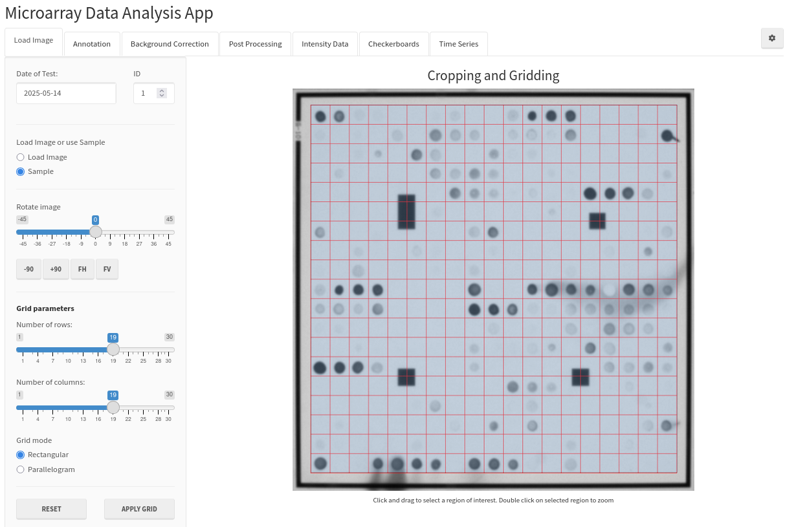
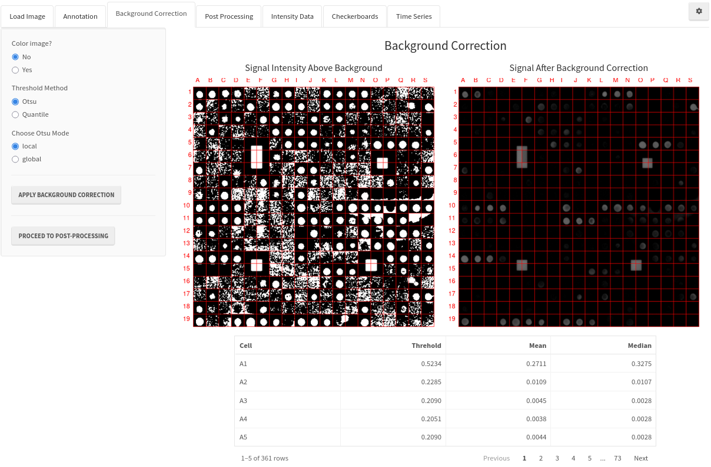
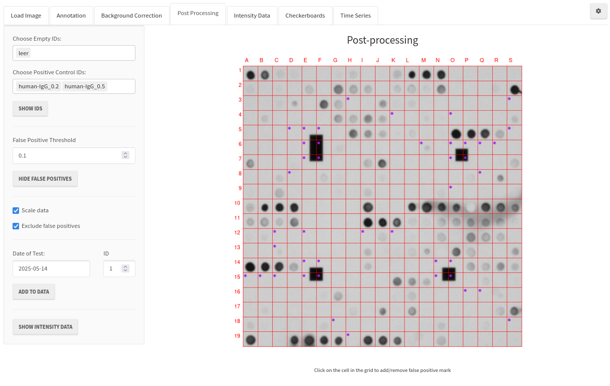
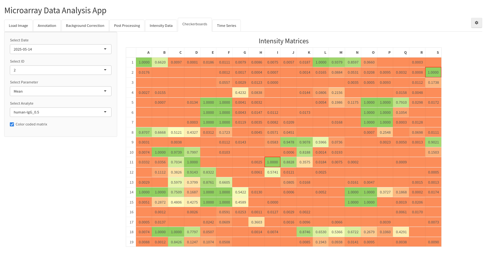
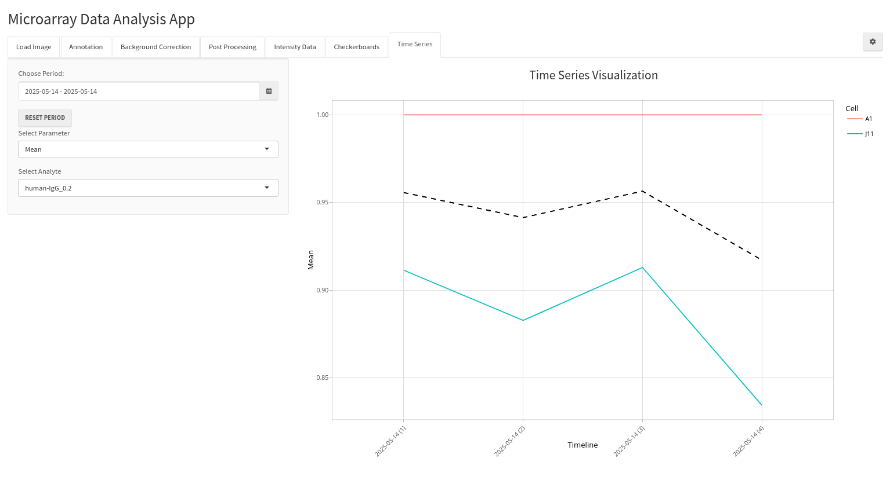

#  Microarray Data Analysis Application (MADApp)
The repository of the development version of shiny application MADApp

[](https://www.gnu.org/licenses/lgpl-3.0)
[](https://www.repostatus.org/#wip)

[](https://microsoft.com/windows/)


MADApp supports both Linux and Windows platforms.

## Installation
To install the required packages, load the project from RStudio and run the following command in the R console:
```{r}
renv::restore()
```
Alternatively, you can open terminal in the MADApp root directory, start R and use the same command in R console.

## System dependencies
Certain R packages require system libraries to be preinstalled. Below are the commands to install these libraries for different Linux distributions:

### Debian/Ubuntu

Use the following command to install the necessary dependencies:
```{bash}
sudo apt install libtiff-dev libfftw3-dev libcurl4-openssl-dev libssl-dev libxml2-dev
```

### Fedora/RHEL

Use this command to install the dependencies:
```{bash}
sudo dnf install libtiff-devel fftw-devel libcurl-devel openssl-devel libxml2-devel
```

* If you encounter errors in the installation process or additional dependencies are needed, please open an issue to report them.

## Start App
To start the application from RStudio, load the project and run the following command in the R console:
```{r}
shiny::runApp()
```

## Description
Microarray Data Analysis Application is an application for a quantification of microarray images.

## Preview






