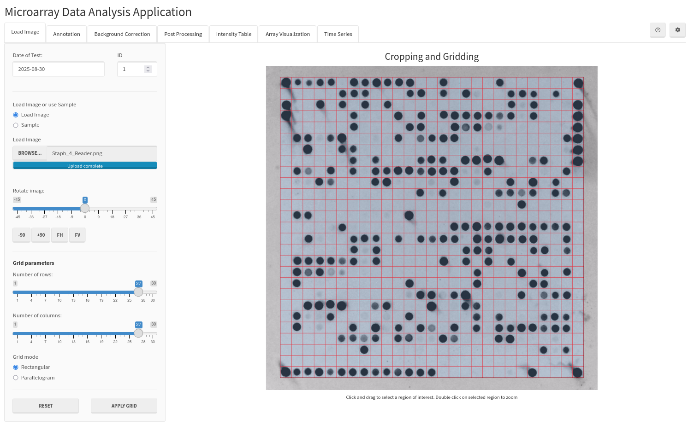
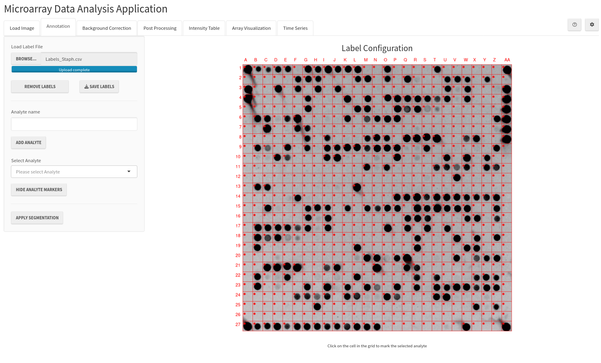
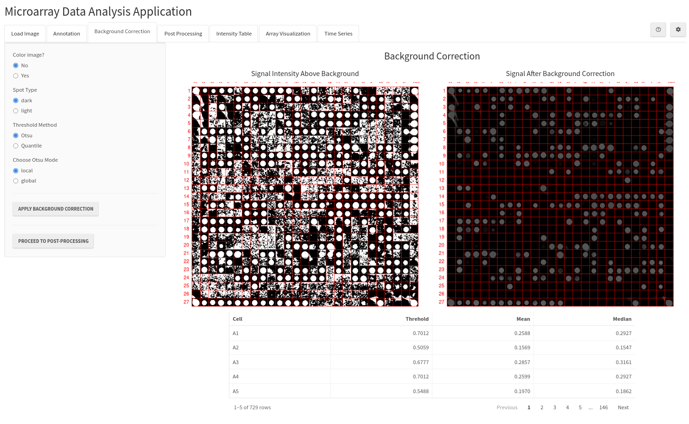
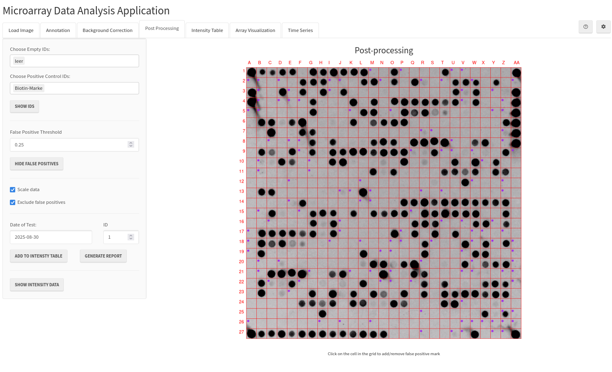
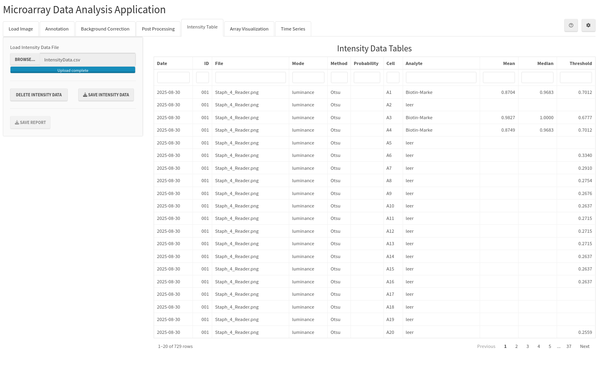
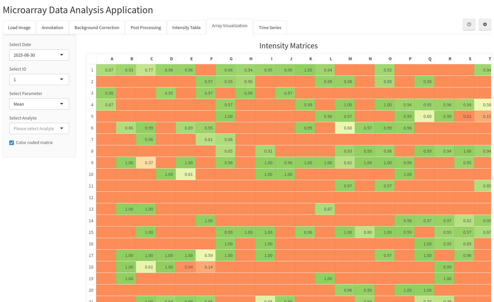
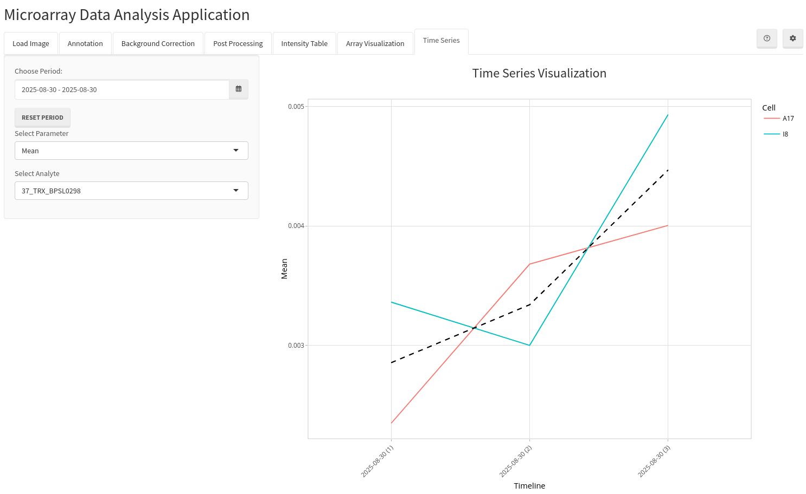

## Introduction
The Microarray Data Analysis App (MADApp) is a shiny application for microarrays data analysis. It offers various modules, for image acquisition, editing, label loading, background correction with multiple available methods, false positive detection of the spots, post-processing, array visualization and time series plotting. It is designed using two-column layout consisting of a structured side panel and a main panel with a visualisation and plotting area. The analysis workflow follows conventional microarray processing steps, with each step organized within one of the seven tabs.

## Tab 1: Image Processing Module
The module facilitates the uploading of images and adjustment prior to analysis (Figure 1).

### Date of test and ID

**Date of Test** allows you to set a custom timestamp for your measurements. If no date is specified, the system automatically usese current date. When working with multiple microarrays that share the same timestamp, you can assign a unique **ID** to distinguish between them. Both date and ID must be unique to successfully add the measurements to intensity data.

### Load Image or Sample

To begin analysis, load an image file or use the provided sample image to explore the application's features. Once loaded, the image appears in the main plot where you can zoom, rotate, and adjust the grid before proceeding with analysis. The application supports standard image formats including PNG, JPEG and TIFF files.

### Rotate Image

The rotation panel enables fine rotation adjustment up to 45 degrees in both directions (clockwise and counterclockwise). For precise control, select the slider and use your keyboard arrow keys to make small adjustments. The image can be also rotated 90 degrees, flipped horizontally or vertically, using respective buttons:

|       Transformation        | Button |
|-----------------------------|--------|
| 90 degrees counterclockwise |   -90  |
| 90 degrees clockwise        |   +90  |
| Flip horizontally           |   FH   |
| Flip vertically             |   FV   |

### Grid parameters

In the **Grid parameters** panel, **Number of rows** and **Number of columns** in the grid can be adjusted. Additionally, there are two grid modes, **Rectangular** and **Parallelogram**, covering different types of arrays.

After loading the image, click and drag on the main plot to define the grid area. Double-click within the region of interest (ROI) to zoom to that region. Use **Reset** button to return to the original zoom level and clear the selection. You can adjust grid parameters before or during the selection process. The following screenshot shows an example of properly pre-processed and gridded image.

```{r, echo=FALSE, fig.align='center', out.width='100%', fig.cap="Figure 1: Overview of the image editing module"}

```

By clicking **Apply Grid** button the selected region is cropped and the analysis proceeds to the next step. To undo all changes and start the from scratch analysis, press **Reset** button.

## Tab 2: Annotation

The annotation interface displays the cropped ROI overlaid with the previously configured grid within the main panel. You can import existing spot assignment data stored in CSV format files, modify pre-existing spot assignments, or generate new array annotations from scratch.

### Load Label File

A comma separated value file (CSV file) containing the annotation information may be loaded here. A annotation data is optional for basic analysis, but certain advanced analysis functions in post-processing module and time series analysis require annotation metadata for full functionality. The annotation file must be CSV file with two columns with no header row. The first column contains the cell name (e.g. A11), and the second contains the analyte name. The application default grid size is 30 x 30, so cell names can be any letter / two letters from A to AD (single: A, B, C ... or double letters: AA, AB ...) combined with numbers 1 through 30. The grid size can be further increased in settings menu.

### Remove Labels

By clicking on this button annotation metadata can be removed from the analysis.

### Save Labels

Label will be saved in a CSV File and the file can be later used in another analysis.

### Add Analyte

If the users wants to create a analyte list from scratch or want to extend the analyte list with new custom name, this can be done by assigning analyte name and adding it to the list by clicking on **Add Analyte** button. To define an analyte on the grid, first the analyte has to be selected in the Select Analyte element and click the desired field in the main plot.

When the analyte name is selected in the **Select Analyte** box, the analyte marker(s) will be shown on the grid with green color in the cells where this analyte is present.

### Hide Analyte Markers

Analyte markers on the grid can also be hidden, to have better overview of the spots in the original image. This can be done by clicking **Hide analyte markers**. To show them again, **Show analyte markers** can be selected.

```{r, echo=FALSE, fig.align='center', out.width='100%', fig.cap="Figure 2: Overview of the annotation module"}

```

When the annotation is finished, or if one chooses to skip this step, one has to click **Apply Segmentation** and the analysis will proceed to the next step.

## Tab 3: Background Correction

In the background correction tab, one of the threshold methods is carried out to improve signal to noise ratio and extract the signal from the background.

### Color image?

The application is designed to perform background correction and extract intensities from grayscale images. Therefore, when working with a standard three-channel colour image, either a specific channel must be selected, or the image must first be converted to grayscale. For this, two approaches can be employed, luminance and grayscale. In the luminance method, the red, green and blue (RGB) channels are weighted and summed according to the formula 0.2126 x R + 0.7152 x G + 0.0722 x B. In the grayscale method, the channels are equally weighted and summed using the formula 1/3 x R + 1/3 x G + 1/3 x B.

### Spot Type
Depending on the type of microarray used, one of the two type of spot detection mode can be selected: dark spot on a light background or light spot on a dark background.

### Select threshold method and apply
The background that is subtracted from the image can be computed using two algorithms: Otsu and quantile. Otsu is an automatic image thresholding method that selects an optimal threshold based on the discriminant criterion. This threshold can be computed globally, using information from all cells, or locally, for each cell individually. The second method, quantile, is a semi-automatic method that computes an empirical quantile from the intensity values of each cell. The computed threshold is used to separate the signal from the background in each cell.

By clicking **Apply Background Correction** the selected threshold method is applied to each cell of the microarray grid. After the thresholding method is applied, two plots and a table containing information are displayed in the main panel of the third tab (Figure 2). The plot on the left side shows the pixels above the threshold, while the plot on the right displays the signal after background subtraction. Additionally, the displayed table shows the calculated intensities alongside the threshold data for each cell of the array. 

To proceed to the post processing step **Proceed to Post-Processing** has to be selected.

```{r, echo=FALSE, fig.align='center', out.width='100%', fig.cap="Figure 3: Overview of the background correction module"}

```

## Tab 4: Post-processing

### Optional: False Positive Spots Detection

In the post-processing tab, the cells with false positive spot (produced by either artifacts or spot leakage in the adjacent cell) will be automatically detected by the algorithm and marked on the screen with purple dot. The algorithm calculates the ratio of pixels above the background to the total number of pixels within each cell and compares this ratio to a user-defined threshold.The default threshold value is 0.2, meaning that any cell with less than 20 percent valid pixels will be marked as false positive. The process is interactive, allowing the user to adjust the threshold to determine the most appropriate value. Additionally, each cell can be manually adjusted after visual inspection. For these field to be excluded from the analysis, **Exclude false positives** has to be selected.

### Optinal: Scaling and signal refinement

Another optional step is scaling and signal refinement, in which the extracted intensities are transformed to fit within a range between zero (indicating no signal), and one (indication the highest intensity) (Figure 4). The 0.9 empirical quantile of background (empty) cells, specified in **Choose Empty IDs** representing IDs of Negative control or Empty Fields, is used to filter out noise and artefacts, while the 0.1 empirical quantile of positive control cells, specified in **Choose Positive Control IDs** representing IDs of Positive control Fields. This is achieve using a modified min-max scaling algorithm, x' = (x - MIN) / MAX, where MIN is a 0.9 empirical qunatile of one or multiple empty cells, and MAX is a 0.1 empirical quantile of on or more cells with the highest intensity. Transformed intensities below zero are excluded, while those above one are set to one. In order to use and apply this changes **Scale data** has to be checked.

Finally, the post-processed data can be added to the intensity data table, by clicking **Add to Data** and the user can proceed with the analysis of another array. Additionally, a HTML report can also be generated (**Generate Report**) that summarises the key analysis results and includes details of all pre-processing steps, the parameters applied and system information, ensuring full transparency and reproducibility.

```{r, echo=FALSE, fig.align='center', out.width='100%', fig.cap="Figure 4: Overview of the post-processing tab"}

```

Clicking **Show Intensity Data** changes the active tab to Intensity Data.

## Tab 5: Intensity Data
The intensity data tab displays a table containing intensity data extracted from the microarrays. This step is also an optional starting step, as previously exported intensity data can be loaded for use in the next two steps. Additionally, the intensity data can be saved as a CSV file or deleted, in which case the analysis can be started from the beginning using a fresh application state. The table contains the following information: date and ID of the analysis, file name, colour conversion mode, thresholding method, grid cell, analyte name, mean and median measurements, and threshold used for background correction.  Each table column can be sorted and filtered.

### Load Intensity Data

Load a CSV file containing Intensity Data from previous analysis.

### Delete Intensity Data

This button can be used to delete the current intensity data and start over.

### Save Intensity Data

The generated intensity data can be saved in CSV file.

```{r, echo=FALSE, fig.align='center', out.width='100%', fig.cap="Figure 5: Overview of intensity data module"}

```

## Tab 6: Array Visualization Overview
In the array visualisation tab (Figure 6), the intensity matrices are used to visualise a measurements in a checkerboard-like table, showing the mean or median intensity, or threshold for each cell. The date and measurement ID of the microarray can be specified in the sidebar, together with an analyte to mark the cell in which it was used. Additionally, the heatmap feature can be used to colour code the table and indicate cells with high intensity. 

```{r, echo=FALSE, fig.align='center', out.width='100%', fig.cap="Figure 6: Overview of checkerboard tab"}

```

## Tab 7: Time Series

In the final tab, Time Series Visualization (Figure 7), one can specify a time period and an analyte to produce a visualisation of analyte intensity over time in the cells where the analyte was used, as well as the average analyte intensity across all cells.

```{r, echo=FALSE, fig.align='center', out.width='100%', fig.cap="Figure 7: Overview of time series tab"}

```
